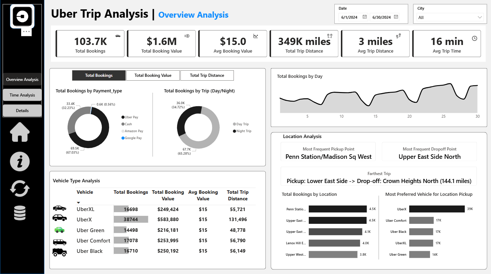

# Uber Trip Analytics

## 📌 Project Overview

This project analyses Uber trip data using **Power BI** to understand booking trends, revenue patterns, trip efficiency, and customer behavior.
The goal is to provide **clear business insights** through interactive dashboards that support data-driven decision making.

The dataset covers Uber trips from **June 01, 2024 to June 30, 2024**, containing **103,728 trip records** along with a supporting **location table**.

---

## 🧾 Problem Statement

Analyse Uber trip data to:

* Track booking and revenue trends
* Measure trip efficiency (distance & duration)
* Understand payment and vehicle preferences
* Identify time-based and location-based demand patterns
* Enable drill-down analysis for detailed investigation

---

## 📊 Key KPIs Answered

* **Total Bookings:** 103.7K
* **Total Booking Value:** $1.6M
* **Average Booking Value:** $15
* **Average Trip Time:** 16 minutes
* **Total Trip Distance:** 349K miles
* **Average Trip Distance:** 3 miles

---

## 🗂️ Data Description

### Tables Used

* **Trip Details Table**

  * 103,728 rows
  * Trip ID, pickup date & time, vehicle type, payment type, passengers, distance, booking value, pickup location
* **Location Table**

  * Location mapping for pickup and drop-off analysis

### Data Period

* **June 01, 2024 – June 30, 2024**

---

## 📈 Dashboards Created

### 1️⃣ Overview Analysis Dashboard

**Focus Areas:**

* Overall booking and revenue KPIs
* Bookings by payment type (Uber Pay, Cash, etc.)
* Day vs Night trip comparison
* Vehicle type performance
* Top pickup & drop-off locations
* Farthest trip analysis

---

### 2️⃣ Time Analysis Dashboard

**Focus Areas:**

* Bookings by pickup time (10-minute intervals)
* Bookings by day of the week
* Hour-by-day heatmap to identify peak demand hours
* Dynamic measure selector (Bookings / Revenue / Distance)

---

### 3️⃣ Details (Drill-Through) Dashboard

**Focus Areas:**

* Trip-level detailed data view
* Drill-through enabled from any visual
* Ability to explore filtered records for deeper analysis

---

## 🔍 Key Insights

* **Uber Pay** is the most preferred payment method among users.
* **UberX** is the most frequently booked vehicle type.
* Bookings gradually increase from **Monday (14.7K)** to **Wednesday (15.7K)**.
* Sharp drop observed on **Thursday (11.2K)** and **Friday (9.3K)**.
* Strong surge during weekends:

  * **Saturday:** 18.7K bookings
  * **Sunday:** 19.7K bookings
* Users clearly prefer traveling more on weekends.

---

## 🛠️ Power BI Features Implemented

* Dynamic KPI cards
* Disconnected table for **measure selector**
* Drill-through functionality
* Bookmarks for navigation
* Interactive slicers (Date, City)
* Conditional formatting
* Heatmaps for time analysis

---

## 📌 Tools & Technologies

* **Power BI**
* **DAX**
* **Excel (Data Source)**

---

## ✅ Conclusion

This project demonstrates the ability to:

* Translate business requirements into dashboards
* Work with large datasets
* Design meaningful KPIs
* Extract actionable insights from data
* Build interactive and user-friendly Power BI reports

---
